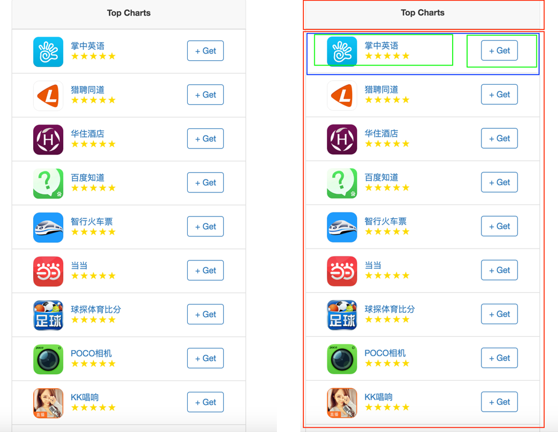
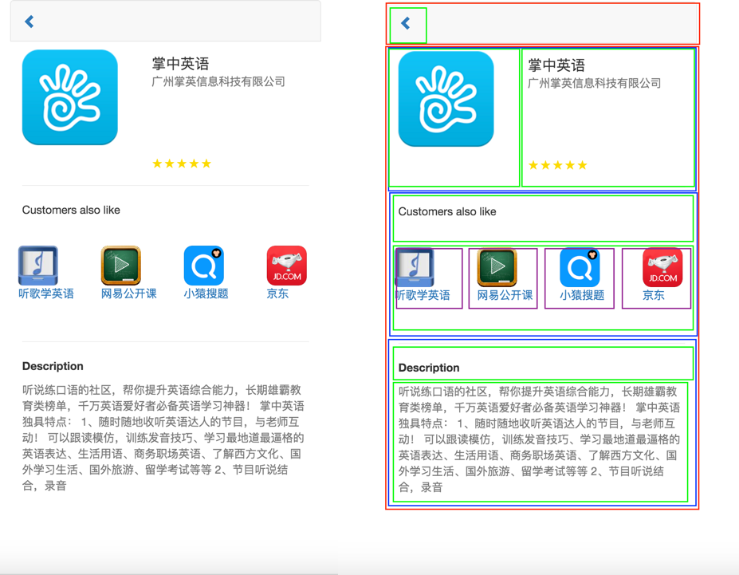

# App Store in React

Author: Lin Dong

Note: [BitTiger](http://bittiger.io) React Project

##Recap

Last time, we have introduce React and JSX, this time we need to implement a simplified version of App Store in React.

##Objective

* Implement an App Store in React.

##Mockups

Clickable Link: [App Store Mockups](https://invis.io/AH604TLWV)

##Task Breakdown
###Think top down, build bottom up

1. Design various react components, *one can add/delete as needed*:

  * Main Layout
    * Header: Nav Bar
    * Content: List View
      * Individual item: ListCell View
  * Details View
    * Information View
    * Recommended View
    * Description View

2. By leverage given data in JSON format, which may contain:

  * title
  * app_id
  * developer
  * intro
  * score
  * thumbnail_url
  * top_5_app
  * numberOfRecommendataions

3. Achieve the [objective](##objective)

# Special Thanks
1. Mockups are extraced from [BitTiger AppStore in Meteor](https://github.com/BitTiger/meteorjs_app_store)
