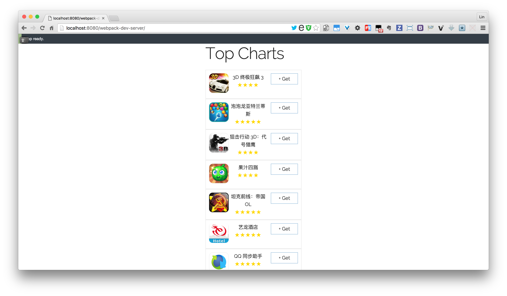
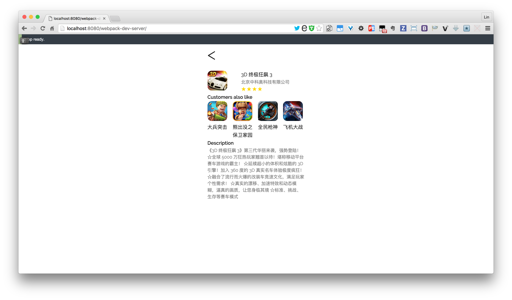
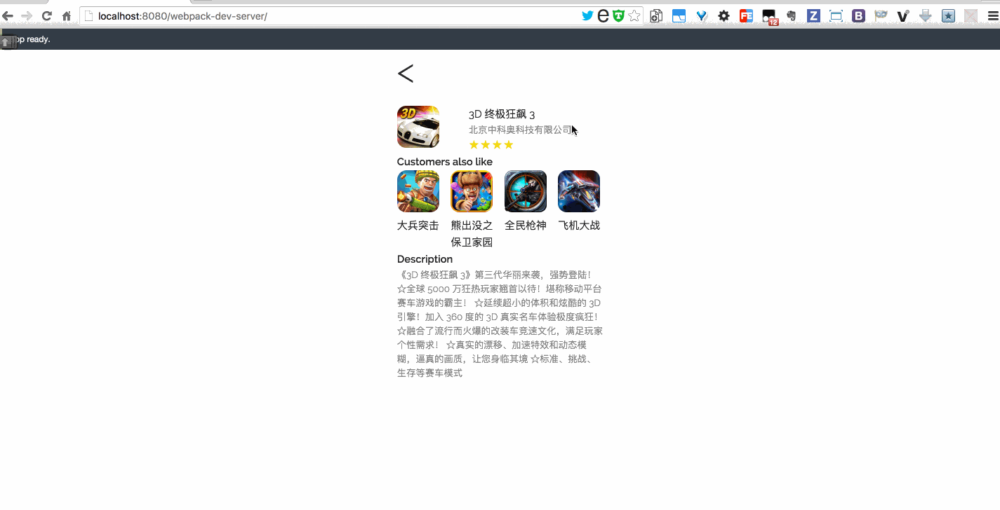

# App Store with React and Webpack

Author: Lin Dong

Date: Sat Feb 13, 2016

## Instruction

```bash
npm install
npm install webpack-dev-server@1.12.1 -g
webpack-dev-server --progress --colors
```

CSS framework: [Skeleton](http://getskeleton.com/)

Now open [http://localhost:8080/](http://localhost:8080/)

## Screenshots






## Reference

1. [Setting up React for ES6 with Webpack and Babel](https://www.twilio.com/blog/2015/08/setting-up-react-for-es6-with-webpack-and-babel-2.html)
